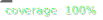

**Type of PR:**
- [ ] Feature
- [ ] Bugfix
- [ ] Hotfix
- [ ] Refactoring
- [ ] Documentation
- [ ] Infrastructure

## Changes Introduced ✨
- Implemented: [feature name] (mention addition functionality if relevant)
- Refactored: [Component/Module] (explain reasoning if significant)
- Fixed: [Bug description] (include error references if applicable)
- Updated: [Documentation/Configuration] (specify locations)

## Screenshots/GIFs (if applicable) 📸
[Screenshot](url)

## Deploy Status

[//]: # (TODO добавить)

## Coverage Status

## Checklist ✅
### Mandatory Requirements
- [ ] Meets all task criteria
- [ ] No console errors (except API requests)
- [ ] 30%+ test coverage 

### Self-Check ✅ 
- [ ] Reviewers have been requested
- [ ] Comprehensive PR description provided
- [ ] Completed self-code review
- [ ] Documentation updated (if relevant)

### Technical Compliance
- [ ] All package.json scripts functional
