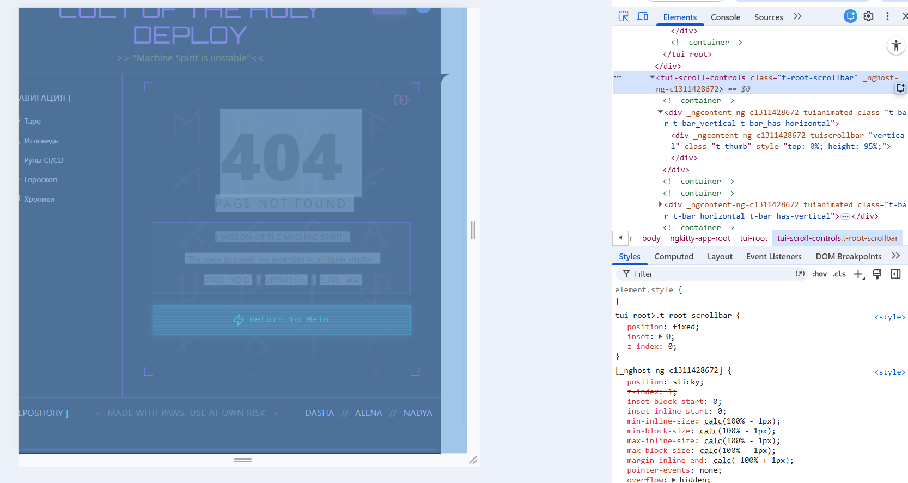
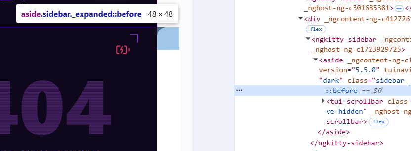

# Sprint 1: Project Setup & Component Basics - 2026-17-05

## What was done:

Сегодня был доделан компонент страницы 404 (not-found). Данный компонент, как и все остальные, `standalone` и использует `ChangeDetectionStrategy.OnPush`.

Сам компонент достаточно простой и никаких особо интересных подходов `Angular` не требовал.

## Problems & Solutions:

Заметила, что sidebar от Taiga UI создавал горизонтальный скролл из-за декоративного `::before` элемента у `.sidebar_expanded`.

Псевдоэлемент выходил за границы контейнера и ломал layout страницы. Пока что временно решила проблему через скрытие элемента, но в будущем хочется найти более правильное решение без переопределения внутренних стилей библиотеки.

Проблемы с работой `Taiga UI` все же продолжают нас преследовать. Библиотеку сложно кастомизировать, встречаются непонятные отступы и встроенные элементы, которые портят внешний вид проекта и мешают стилизации.

## What I learned:

Страница имеет кнопку перехода на главную через `router.navigate()`.

Использовала именно `router.navigate`, а не `routerLink`, потому что на кнопке линтер ругался на использование `routerLink`. Хотя сам `routerLink` мне кажется очень удобным, особенно если делать полноценное меню навигации.

Также узнала про `routerLinkActive`, который позволяет `Angular` автоматически отслеживать активную ссылку без необходимости вручную добавлять активные состояния.

Если в будущем буду делать несколько навигационных кнопок или меню, обязательно воспользуюсь этим подходом.

Также немного поработала с `lazy loading`. Ленивая загрузка помогает не загружать сразу все страницы приложения, а подгружать их только тогда, когда пользователь действительно переходит на нужный роут.
## Plans:

По плану на второй Sprint 2 настроить transloco, сделать login page и начать работу над исповедальней.

## Time spent:

5 часов (за 2 дня)
