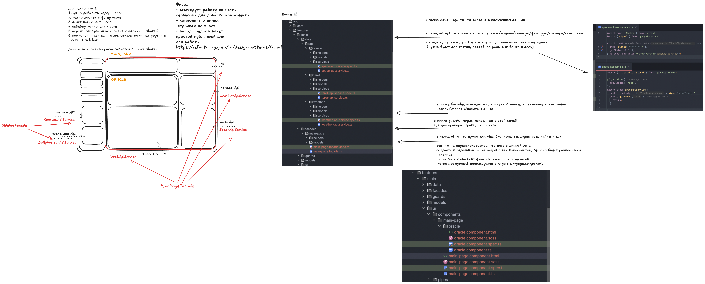

# Sprint 1: Project Setup & Component Basics - 2026-14-05

## What was done:
Я засетапила проект, написала стайлгайды для команды, проанализировала все документы по заданию и создала таски на нашей гитхаб доске, создала компонент леяут и почти завершила создание компонента сайдбар. Кроме того на нулевой неделе мы сделали много работы. Мы искали идеи для кастомного проекта, много брейнштормили и созванивались. Мои коллеги сделали каждая по макету в фигме для того, чтобы нам было полегче представлять что мы будем делать. Итого у нас будет онлайн церковь для программистов со всякими предсказаниями нафаршированная разными апишками с тарошками, хуешками, исповедальней. Ну должно получиться весело во всяком случае.
## Problems:
Ну первая проблема это то, что так вышло что мне приходится тимлидить. Я работаю полный день и мне сложно находить время на курс. Я вообще не планировала, хотела лишь учить ангуляр, писать коды, делать че скажет кто нибудь, но получилось как получилось. А сейчас помимо того что надо все это учить, нужно продумывать кому какие таски делать чтобы все могли выполнить чекпоинты, нужно спроектировать приложение, разобраться кто что и как будет делать, делать кодревью, даже учитывая, что у нас есть нейросасарик, который с помощью Клода ревьюит код, но меня пока мало устраивает качество того ревью. Никто не отменяет и подготовку к интервью. Не знаю будет ли время вообще на это на этой неделе… будет прикол если завалю конечно
## Solutions:
Решением было бы либо не спать, либо 30 часов в сутках. Пока ни того ни того не могу себе позволить.
## What I learned:
Пока что ничего для себя нового особо не узнала, к сожалению. Ну разве что понюхала Тайга юай, до этого мне пришлось лишь раз на нее смотреть, причем в сорс код, по работе, когда писала директиву и пайпу для вывода всех ошибок сразу в форме. Попробую узнать что то на выходных.
## Plans:
Я фантазирую так: на этой неделе мы разобрали один экран нашего приложения, а на втором спринте мои тиммейты разберут те страницы которые им надо будет разрабатывать. Нарисуют диаграмму со связями, распишут компоненты и сервисы которые им надо будет реализовать. Ловко? А после этого я создам им таски на доске. А дальше пахать. Мне кажется получится не плохой образовательный процесс для тиммейтов, у них чуть поменьше опыта, чем у меня, чувствую, что это будет полезно
## Time spent:
100500 часов
