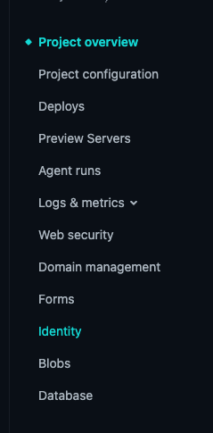
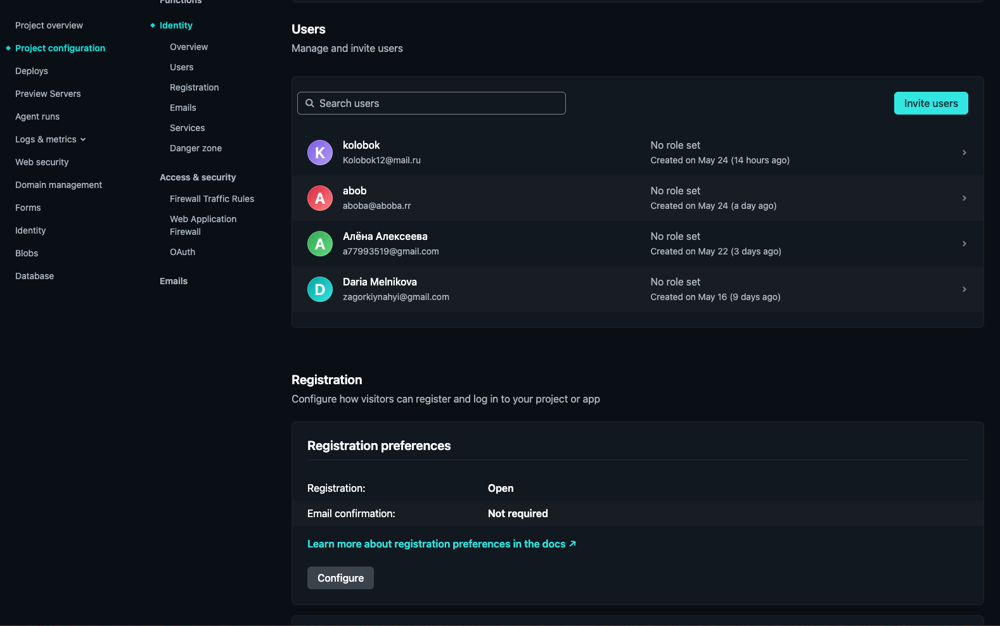

# Sprint 1: Project Setup & Component Basics - 2026-14-05

Непонятно конечно какой это спринт, но пусть будет первый...

## What was done:
с прошлой записи прошло много времени, больше недели. Было сделано многое - я сделала auth сервис для регистрации, сделана также страница регистрации, добавлены таски на борду для второго спринта и даже уже половина сделана...
Сервис авторизации я решила делать с использованием netlify identity - оказался очень удобный и простой интсрумент.Netlify предоставляет все что нужно для регистрации и управляется жто все из профиля проекта, я в восторге.  

Также мной была сделана страница регистрации. Я придерживаюсь того, чтобы все зоны ответственности были жестко разграничены и учу этому тиммейтов. 
Для этой страницы создан UI компонент, который отвечает только за отображение, создан сервис для создания формы, создан фасад для общения сервисов авторизации и формы с компонентом отображения. 
Несмотря на то, что у нас маленькое приложение, я считаю это важным и слежу за этим. Но не могу сказать, что не встречаю сопротивления, об этом ниже.

## Problems:
Самая большая проблема за это время это был конфликт с один из "псевдоменторов" нашей команды. 
В нашей команде практиковалось кодревью от АИ агента, Нейросасарика. 
Он не идеален, кроме того его владелец настроил его так, чтобы он оставлял оскорбительные комментарии в ПР, потому что ему так нравится. 
Но это не самое главное, с этим можно жить. 
Важно то, что комментарии не всегда релевантны, примерно половина, на мой взгляд, не очень содержательна, но вторая половина довольно полезна. 
В своих ПР я валидировала эти комментарии и исправляла.
Конфликт случился между мной и владельцем Агента. 
В итоге владелец машины решил исправлять мой код, делать свои коммиты в мой ПР, что меня очень задело. 
В итоге я чуть не приняла решение уйти с курса, так как приходилось не учить ангуляр, а спорить об архитектуре (нужны ли в приложении фасады) и еще каких то бессмысленных вещах, что сильно выматывало. 

Помимо этого, я хотела попробовать сигнальные формы, вместо реактивных на форме регистрации. Я провозилась часа 4, а в итоге выяснилось, что наша библиотека taiga ui еще с ними не дружит. Ну или о понятно, они все еще не в stable статусе. Небольшое разочарование.

В целом настроение упадническое и пока что я разочарована тем, как проходит курс для меня лично.

## Solutions:
В итоге наша команда отказалась от взаимодействия с этим АИ инструментом, а сигнальные формы пришлось заменить на реактивные...

## What I learned:
За прошедшие дни я смотрела прошлогоднюю лекцию по компонентам, хочу еще успеть посмотреть про DI, но не уверена, что успею, так как я лечу на море РАБОТАТЬ. отпуск вероятно мне не светит в ближайшее время из за высокой нагрузки на работе, поэтому хоть так понюхаю море...

## Plans:
Посмотреть лекцию по DI, начать делать страницу Main и написать гванд для неавторизованных пользователей. 
Почистить репозиторий от мертвого кода после Нейросасарика.
Посмотреть Netlify DB, как оно работает и можно ли бесплатно прикрутить к нашему проекту.

## Time spent:
Очень много времени, которое можно было потратить на отдых и сон. Но учеба в Рс их не подразумевает в принципе.
