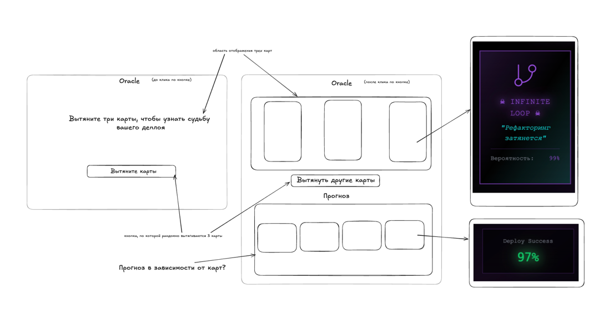
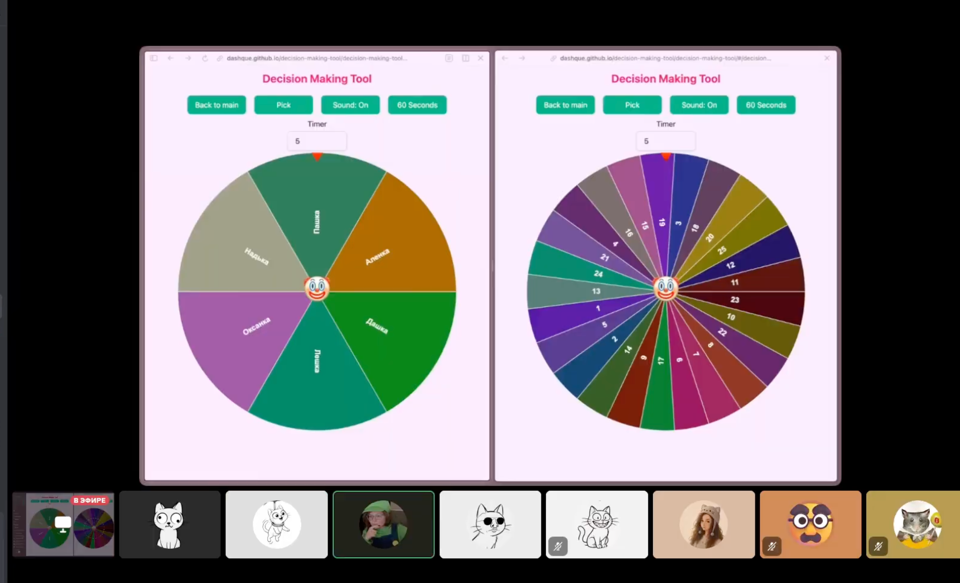

# Sprint 2: Routing & Signals - 2026-30-05

## What was done:
на этой неделе я работаю у моря, пожтому мне не хотелось ваще ниче делать. но делать пришлось, потому что было плохая погода. я почти не загорела 🥲и мало купалась...
поэтом сделала гвард, который вешается на те роуты, где есть форма, и не пускает пользователя со страницы, есл и она была потрогана.
я почитала немного туториалов на медиуме, как делать такой гвард, они мне не понравились. я посмотрела как реализован подобный гвард у меня на работе, он мне тоже не понравился. в итоге, я навояла свой говногвард 🤡
в чем его прикол - он принимает копонент страницы, и если там есть форма, то он смотрит дерти ли она, и если дерти то показывается модалка, где нужно подтвердить уход со страницы.
для модалки я использовала сервис из тайги, написала наш внутренний сервис обертку для более простого использования метода показа модалки.
в итоге мне более менее нравится решение. но уверена есть лучше.

## Problems:
ну было сложно тестировать гвард, впервые тесты на него писала. вообще это сложновато конечно, даже учитывая что у меня на работе принято все тестировать.

## Solutions:
подсказал чат как тестировать, его решение я тоже переработала. кончено нейронки в тестах очень плохи, какие бы скилы им не дать, пишут какой то кринж

## What I learned:
я изучала тайгу, изучала гварды, какой за что отвечсет и когда срабатывает. подсказала Алене про гвард canMatch вместо canActivate (он раньше срабатывает и не загружает код который не должен быть доступен пользователю)
кроме того я вчера разобрала как я буду писать главную страницу, декомпохировала ее, нарезала таски для нее, нарисовала схему

также много готовилась к интервью. 
про интервью можно вообще отдельно рассказывать. наш ментор решил что мы сами его и пройдем. я придумала использовать decision making tool с основного стейджа для рандомного выбора вопросов и отвечающих. получилось как мне кажется очень весело.

## Plans:
подготовить таски для третьего и четвертого спринта, елать свою главную страницу потихоньку. мы двигаемся с опережением плана конечно, мы молодцы
## Time spent:
очень много времени, ну суммарно часов 30 наверное 