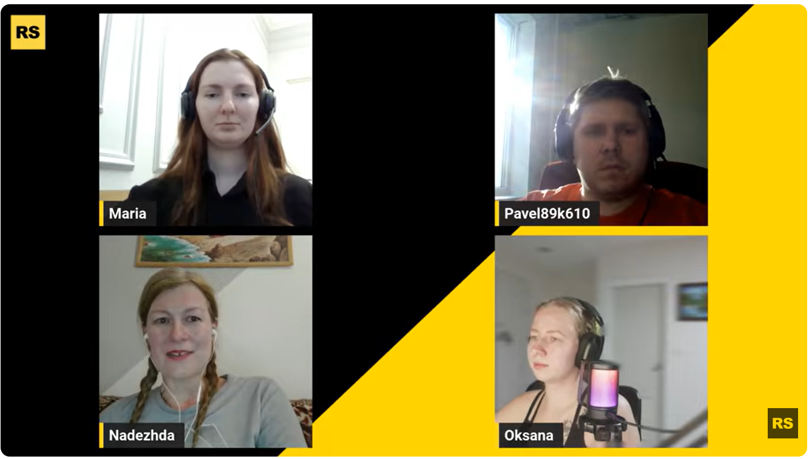

# Sprint 1 - making of the second component (kozochkina82)

## What was done

Сделала второй компонент - элемент навигации (navigation item)
Выглядит вот так:

Также мы провели стрим. Вот ссылка на него:

## Problems:

Нужно внести исправления в компонент, привести в соответствие с техзаданием и стайлгайдом.\

## What I've Learned

Я научилась вести стримы на английском, ура. Это был мой первый опыт, и я считаю, что он удался.
Осваиваю новый ноутбук. У меня клавиатура с балканской раскладкой, и я печатаю по памяти. Главное, не задумываться при этом.

## Plans

Закончить компонент навигации.

## Time-spent

Весь день вчера. Сегодня минимум 3 часа ушли на стрим: два часа подготовка, 1 час сам стрим. Сегодня планирую все доделать.
