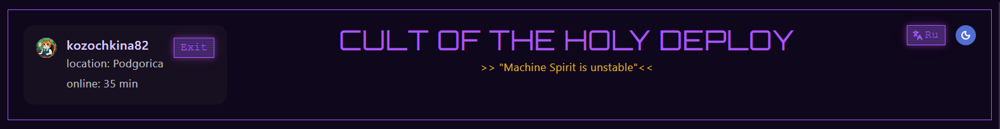

# Sprint 1, making of the first component (kozochkina82)

## What was done

Я сделала переиспользуемый компонент - хедер. В хедер добавлены кнопки:
- смена темы
- смена языка
- карточка пользователя, где отражены аватар, время на сайте, локация и кнопка "выход".

Карточка была впоследствии удалена тимлидом, так как она делает хедер слишком широким.

## Problems:

- Во-первых, я заметила, что на pre-commit файлы проходят проверку prettier, а на pre-push проверку eslint. Таким образом, приходится делать минимум один лишний коммит или же делать проверку вручную. Мне кажется, удобнее было бы эслинт проверять тоже на уровне пре-коммита.

- Во-вторых, у меня в самом начале была проблема с коммитом - требовалась установка jsDom, и путем длительных выяснений и экспериментов мы решили его все же установить.

- Проблема 3 - я установила по ошибке не jsDom, а HappyDom, и это повлияло на файл package.json, поэтому мои изменения не проходили тесты github и они падали. Эту ошибку мне помогли исправить.

Кроме того, еще мы готовимся к стриму на английском и это занимает прилично времени и нервов. Это мой первый такой стрим, а мой уровень английского - лет ми спик фром май харт. Короче, планируется публичный позор, и к нему нужно получше подготовиться.

Нужно готовиться и к интервью, но пока я все еще очень плохо понимаю ангуляр. К сожалению, мне тяжело воспринимать на слух лекции, а что показывают на экране, я плохо вижу, даже если увеличить. Я могу что-то понять только с помощью чтения и экспериментов. Ну и возможности интеллекта, как и время, сильно ограничены.

## Solutions

Мне помогали товарищи по команде, а так я бы вообще не знала, что делать. Спасибо им, что пока что меня терпят.

## What I've Learned

Я научилась некоторым штукам из Ангуляр, например, сигналы, пайплайны, инпут и аутпут.
Я еще научилась создавать автоматически новые компоненты, а сначала я делала это руками и это было сложно, и результат всех бесил. Еще я узнала, что нельзя делать на гитхабе conversation-resolved, это можно делать с ии-ревьювером, а живых людей это напрягает. А я их делала ранее, так как страдаю легкой формой ОКР и мне надо, чтоб все было в порядке и все conversation были resolved, а иначе у меня гештальт незавершен и мне тревожно.

## Plans

- Доделать второй компонент - navigation-item.
- Готовиться к интервью по Angular.
- Провести стрим.

## Time-spent

Довольно много, ну наверное 2-3 дня с утра до вечера.